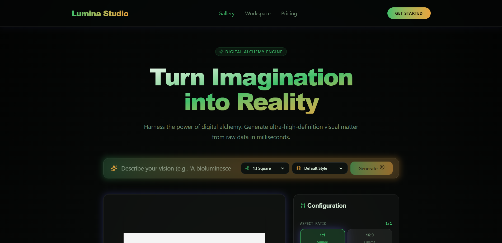

# 🚀 Lumina Studio (Lumina AI)

> **Transform imagination into stunning AI-generated artwork with a modern, high-performance image generation platform.**

Lumina Studio is a full-stack AI-powered image generation application built with **React, TypeScript, Vite, and Node.js**. It provides an elegant and responsive interface where users can generate high-quality AI images from text prompts, explore different artistic styles, manage their generation history, and download generated images with a single click.

Designed with both **developers** and **beginners** in mind, this project demonstrates how a modern AI application can be built using a React frontend connected to a Node.js backend that communicates with an AI image generation model.

---

# 📸 Preview

> 

```
assets/
├── home-page.png
├── generation-page.png
├── gallery.png
└── pricing.png
```

---

# ✨ Features

## 🎨 AI Image Generation

Generate beautiful AI-generated artwork simply by describing your imagination in natural language.

Example Prompt

> "A futuristic cyberpunk city during sunset with flying cars."

---

## ⚡ Lightning Fast Interface

Built with **React + Vite**, providing

* Instant page loading
* Fast Hot Module Reload (HMR)
* Smooth animations
* Optimized performance

---

## 🖼️ Multiple Aspect Ratios

Generate images in different dimensions depending on your needs.

Supported ratios:

* 1:1 (Square)
* 16:9 (Landscape)
* 9:16 (Portrait)
* 4:3
* 3:4

---

## 🎭 Multiple AI Styles

Choose different visual styles before generating.

Current styles include:

* Default
* Neon Dystopia
* Cosmic Impasto
* Prismatic Void
* Anime / Digital Art
* Watercolor
* Photorealistic

---

## 📂 Local Generation History

Every generated image is automatically stored inside your browser's Local Storage.

History includes:

* Prompt
* Original Prompt
* Style
* Aspect Ratio
* Resolution
* Generation Time

No database is required.

---

## 📥 One Click Download

Download generated images directly to your local computer.

Supports

* PNG
* High Resolution
* One Click Export

---

## 📱 Fully Responsive

The application works beautifully on

* Desktop
* Laptop
* Tablet
* Mobile Devices

---

## 🎯 Modern UI

Lumina Studio features

* Glassmorphism
* Gradient UI
* Animated Components
* Blur Effects
* Modern Typography
* Dark Theme
* Interactive Hover Effects

---

# 🛠️ Built With

## Frontend

* React
* TypeScript
* Vite
* CSS3
* HTML5
* Lucide React

---

## Backend

* Node.js
* Express.js
* TypeScript

---

## AI

* Local AI Translation Node
* Image Generation API
* Prompt Processing Engine

---

## Storage

* Browser Local Storage

---

## Development Tools

* VS Code
* npm
* Git
* GitHub

---

# 📁 Project Structure

```text
lumina-ai/
│
├── assets/                     # Static assets
│
├── src/
│   ├── App.tsx                 # Main application
│   ├── main.tsx                # React Entry
│   ├── index.css               # Global styling
│   └── responsive.css          # Responsive layouts
│
├── .env                        # Environment variables
├── .env.example                # Example environment file
├── .gitignore
├── index.html
├── metadata.json
├── package.json
├── package-lock.json
├── README.md
├── requirements.txt
├── server.ts                   # Backend Server
├── tsconfig.json
└── vite.config.ts
```

---

# ⚙️ Prerequisites

Before running the project, make sure the following software is installed.

## Install Node.js

Download

https://nodejs.org

Recommended Version

```
Node.js 18+
```

Verify Installation

```bash
node -v
```

Example

```
v22.17.0
```

---

Verify npm

```bash
npm -v
```

Example

```
10.9.2
```

---

Install Git

Download

https://git-scm.com

Verify

```bash
git --version
```

---

# 📥 Installation Guide (Beginner Friendly)

## Step 1

Clone the repository

```bash
git clone https://github.com/YOUR_USERNAME/lumina-ai.git
```

---

## Step 2

Move inside the project

```bash
cd lumina-ai
```

---

## Step 3

Install dependencies

```bash
npm install
```

Wait until npm finishes downloading all packages.

---

## Step 4

Create your environment file

Copy

```text
.env.example
```

Rename it to

```text
.env
```

Example

```env
API_KEY=YOUR_API_KEY
PORT=3000
```

Replace

```
YOUR_API_KEY
```

with your own AI provider API key.

---

## Step 5

Start the backend server

```bash
npm run server
```

or

```bash
npx tsx server.ts
```

The terminal should display something similar to

```
Server Running

http://localhost:3000
```

Leave this terminal running.

---

## Step 6

Open another terminal.

Run the frontend.

```bash
npm run dev
```

You should now see

```
Local:

http://localhost:5173
```

---

## Step 7

Open your browser.

Visit

```
http://localhost:5173
```

The application is now ready.

---

# 🎨 How to Generate Images

1. Enter a prompt.

Example

```
A white wolf standing in snowy mountains.
```

2. Select an aspect ratio.

3. Select a style.

4. Click

```
Generate
```

5. Wait a few seconds.

6. Your AI-generated image will appear.

7. Click Download to save it.

---

# 📥 Downloading Images

Simply click

```
Download
```

The generated image will automatically be downloaded to your computer.

---

# 🗂 Generation History

Every image is automatically saved locally.

The history stores

* Image
* Prompt
* Style
* Aspect Ratio
* Time
* Resolution

You can revisit previous generations anytime during the same browser session (or until Local Storage is cleared).

---

# 📦 Available Scripts

Install dependencies

```bash
npm install
```

Run frontend

```bash
npm run dev
```

Build project

```bash
npm run build
```

Preview production build

```bash
npm run preview
```

Run backend

```bash
npm run server
```

---

# 🌍 Environment Variables

Example

```env
API_KEY=YOUR_API_KEY
PORT=3000
```

Never commit your real `.env` file to GitHub.

---

# ❓ Common Issues

## npm install fails

Delete

```
node_modules
package-lock.json
```

Then run

```bash
npm install
```

---

## Backend won't start

Check

* Node.js is installed
* `.env` exists
* API key is valid
* Port 3000 is not already in use

---

## Frontend cannot connect to backend

Make sure the backend server is running first.

Expected backend URL

```
http://localhost:3000
```

---

## Images are not generating

Check

* Internet connection
* AI API key
* Backend logs for errors

---

# 🚀 Future Improvements

* User Authentication
* Cloud Storage
* Image Upscaling
* AI Image Editing
* Favorites Collection
* Public Gallery
* Dark/Light Theme Toggle
* Multiple AI Providers
* Batch Image Generation
* Prompt Templates
* Image Sharing
* Prompt History Search

---

# 🤝 Contributing

Contributions are always welcome.

1. Fork the repository.

2. Create a new branch.

```bash
git checkout -b feature-name
```

3. Commit your changes.

```bash
git commit -m "Added new feature"
```

4. Push your branch.

```bash
git push origin feature-name
```

5. Open a Pull Request.

---

# 📄 License

This project is licensed under the **MIT License**.

You are free to use, modify, and distribute this project.

---

# 👨‍💻 Author

**Muhammad Zaeem Ahmad**

Full Stack MERN Developer

GitHub

https://github.com/chzaeem47

LinkedIn

https://linkedin.com/in/muhammad-zaeem-ahmad-06a5a0363

---

# ⭐ Support

If you found this project useful,

⭐ Star the repository

🍴 Fork the repository

📢 Share it with others

Your support helps improve the project and motivates future development.
